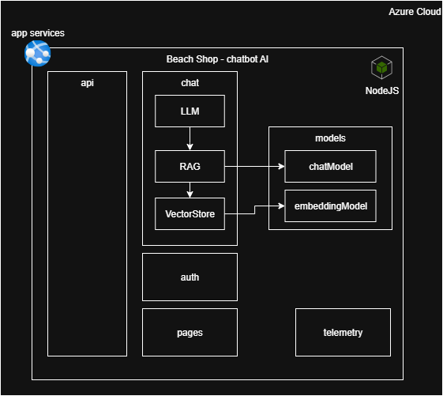
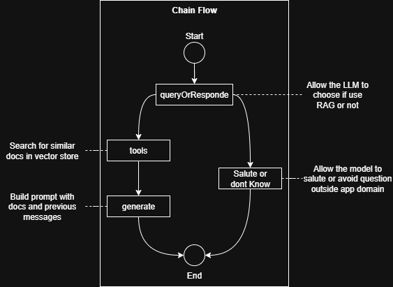

# Chatbot Challenge AI

## Overview

Chatbot Challenge AI is a full-stack web application featuring a modern React (Vite, TypeScript) frontend and a Node.js/Express backend. It provides authentication, a chat interface, and a RAG (Retrieval-Augmented Generation) system for enhanced AI-powered responses. The project demonstrates best practices in API design, UI/UX, and testing.

#### Service architecture



#### RAG chain flow



## User stories
user stories can be found in:
```
docs/stories/user-stories.md
```

## Features

- User registration and login with JWT authentication (cookie-based)
- Modern, responsive UI with React, React Router, and Tailwind CSS
- Product listing with beachwear recommendations
- Chat interface powered by OpenAI and RAG workflow
- Axios interceptor for error handling
- Local storage hook for persistent data
- Unit and integration tests (Jest, Supertest, Vitest, React Testing Library)
- GitHub Actions for CI/CD

## Project Structure

```
chatbotChallengeAI/
├── chat-ui/                # Frontend (React, Vite, TypeScript)
│   ├── app/
│   │   ├── components/     # Reusable React components
│   │   ├── hook/           # Custom React hooks
│   │   ├── routes/         # Route components (login, register, home, etc.)
│   │   ├── services/       # Axios interceptor, API services
│   ├── public/             # Static assets
│   ├── package.json        # Frontend dependencies
├── chat-ws/                # Backend (Node.js, Express)
│   ├── src/
│   │   ├── application/
│   │   │   ├── auth/       # Auth service (JWT, user management)
│   │   │   ├── chat/       # LLM service
│   │   │   ├── rag/        # RAG workflow, vector store
│   │   ├── infrastructure/
│   │   │   ├── api/        # Express routers
│   │   │   ├── assets/     # Product and recommendation data
│   │   │   ├── models/     # Model definitions
│   ├── test/               # Backend tests (Jest, Supertest)
│   ├── package.json        # Backend dependencies
├── README.md               # Project documentation
```

## Setup Instructions

### Prerequisites
- Node.js (v18+ recommended)
- npm

### Backend Setup
1. Navigate to `chat-ws/`
2. Install dependencies:
   ```bash
   npm install
   ```
3. Create a `.env` file if needed (for `JWT_SECRET`, `OPENAI_API_KEY`)
4. Start the backend server:
   ```bash
   npm start
   ```

### Frontend Setup
1. Navigate to `chat-ui/`
2. Install dependencies:
   ```bash
   npm install
   ```
3. Start the frontend app:
   ```bash
   npm run dev
   ```

## Usage

- Register a new user or log in with existing credentials
- Browse beachwear product recommendations
- Use the chat interface to ask questions or get outfit suggestions

## Testing

### Backend
- Run all backend tests:
  ```bash
  npm test
  ```
- Tests cover authentication, chat, RAG workflow, and vector store logic

### Frontend
- Run all frontend tests:
  ```bash
  npm run test
  ```
- Tests cover UI components, hooks, and integration flows

## Technologies Used

- **Frontend:** React, Vite, TypeScript, React Router, Tailwind CSS, Axios
- **Backend:** Node.js, Express, JWT, OpenAI, LangChain, RAG, Supertest, Jest
- **Testing:** Jest, Supertest, Vitest, React Testing Library
- **CI/CD:** GitHub Actions

## License

MIT License
